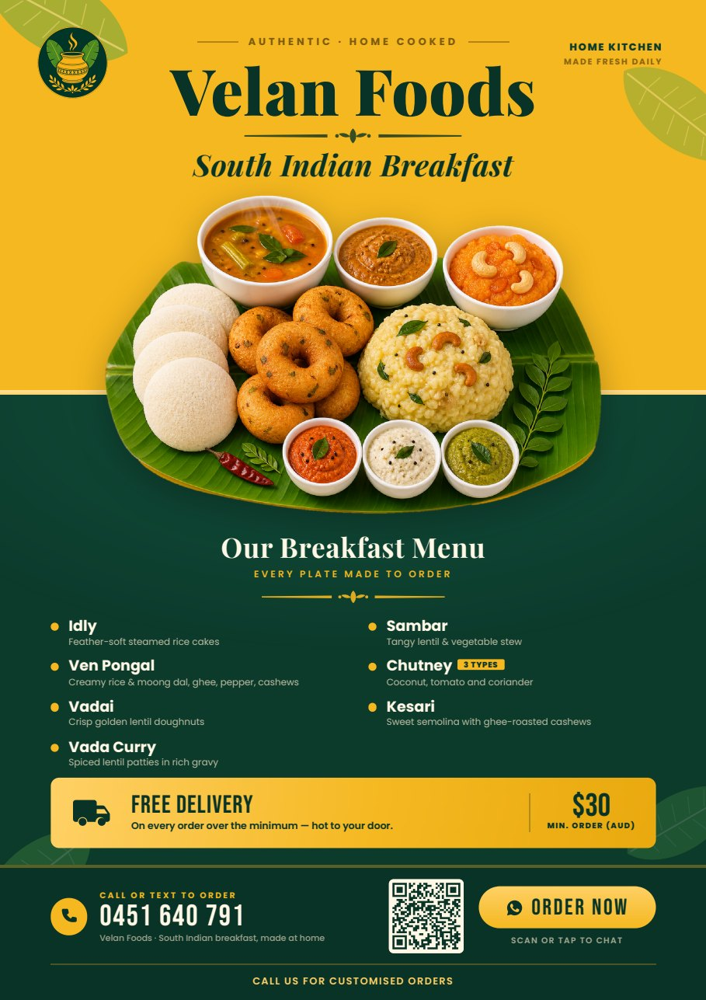

# Velan Foods — one-page pamphlet

A print-ready A4 flyer for Velan Foods' South Indian breakfast menu. The
design is a single HTML file with all measurements in millimetres, so what you
see on screen is exactly what comes out of the printer.



## What to hand to a printer

| File | Use |
| --- | --- |
| `out/velan-foods-pamphlet.pdf` | Send this to a print shop. A4 portrait, single page, full-bleed colour. |
| `out/velan-foods-pamphlet.png` | 200 dpi image for WhatsApp, Instagram or email. |
| `out/velan-foods-pamphlet-standalone.html` | The whole pamphlet in one file (fonts and photos inlined). Open in any browser and print — no other files needed. |
| `preview.jpg` | Small preview for viewing on the web, as shown above. |

Note that GitHub shows `.html` files as source code rather than rendering them.
To see the flyer, open `preview.jpg` or the PDF, or download an HTML file and
open it in a browser.

## Details on the flyer

- **Business:** Velan Foods — South Indian Breakfast
- **Menu:** Idly, Ven Pongal, Vadai, Vada Curry, Sambar, Chutney (3 types), Kesari
- **Phone:** 0451 640 791
- **Offer:** Free delivery, minimum order $30 AUD
- **WhatsApp:** `https://wa.me/61451640791`

The "Order Now" button is a real hyperlink, so it is tappable in the PDF and in
the HTML, and the phone number links to `tel:+61451640791`. Neither of those
helps on paper, so the QR code beside the button carries the same WhatsApp link
for anyone holding a printed flyer.

## Editing

Text and prices live in the markup at the bottom of
`velan-foods-pamphlet.html`; colours and type sizes are CSS custom
properties and rules at the top of the same file. The palette is deep green
`#0c3b2c` with mustard gold `#f5b820`.

Because the page is absolutely positioned to fixed millimetre coordinates,
changing the amount of text can push a block into its neighbour. The vertical
budget for the A4 page is:

| Block | Top | Notes |
| --- | --- | --- |
| Masthead | 8 mm | Logo, eyebrow rule, name, flourish, italic tagline |
| Platter | 58 mm | Overlaps the masthead's lower margin and the band change |
| Colour band change | 116 mm | Gold hairline; the platter straddles this line |
| Menu | 157 mm | Heading, gold flourish, two columns of 4 + 3 items |
| Delivery offer | 231 mm | |
| Footer | 257 mm | Phone, QR and call to action, then the customised-orders line |

After editing, re-render and check the result. The tightest clearances are the
4 mm between the italic tagline and the steam at the top of the platter, and the
3 mm between the last menu item and the delivery band. The footer leaves a 5 mm
margin below the last line of type, which is the trim safety allowance.

## Re-rendering

```bash
python3 tools/make-qr.py            # only after changing the phone number
./tools/render.sh                   # HTML -> PDF, then PDF -> PNG and preview
python3 tools/build-standalone.py   # inline everything into one HTML file
```

If the phone number changes, update it in three places: the visible number and
the `tel:` link in the markup, the `wa.me` link on the button, and
`WHATSAPP_URL` in `tools/make-qr.py`. Then regenerate the QR, or the code will
still point at the old number. `make-qr.py` decodes the image it just wrote and
fails loudly if it does not match, so a stale or corrupt QR cannot slip through.

`render.sh` drives headless Chrome. It deliberately calls
`/usr/bin/google-chrome-stable` rather than the `google-chrome` wrapper on this
machine, because that wrapper forces `--remote-debugging-port` and headless
Chrome then never exits. The PNG is rasterised from the PDF rather than
screenshotted, so the preview can never drift from the printed output.

Requires Python with `Pillow` and `pypdfium2`.

## Assets

- `assets/platter.png` — the breakfast platter, generated then background-keyed
  to transparency so the banana leaf can straddle the gold and green bands.
- `assets/logo.png` — circular pot-and-leaf emblem.
- `assets/whatsapp-qr.png` — WhatsApp click-to-chat code, generated by
  `tools/make-qr.py`. It uses the bare `wa.me` link with no prefilled message:
  adding the greeting that the clickable button carries pushed the symbol from
  29 to 57 modules, which at a 22 mm printed square is 0.35 mm per module and
  too fine to scan off paper reliably.
- `assets/fonts.css` — Playfair Display, Poppins and Bebas Neue, latin subsets
  embedded as base64 so the flyer never depends on a network or on locally
  installed fonts. These are static per-weight instances from Fontsource, not
  the variable fonts the Google Fonts API now serves: Chrome embeds variable
  fonts into PDFs as Type3 glyph procedures, which some prepress RIPs render
  poorly and which breaks text selection. The PDF should contain only Type0
  fonts, which you can confirm with:

  ```bash
  python3 - <<'PY'
  import re
  raw = open('out/velan-foods-pamphlet.pdf', 'rb').read()
  print('Type3 (want 0):', len(re.findall(rb'/Subtype\s*/Type3', raw)))
  print('Type0 (want 8):', len(re.findall(rb'/Subtype\s*/Type0', raw)))
  PY
  ```

`tools/make-cutouts.py` and `tools/embed-fonts.py` regenerate the transparent
cutouts and the font stylesheet respectively.

Requires `segno` and `opencv-python-headless` in addition to `Pillow` and
`pypdfium2` if you need to regenerate the QR code.
